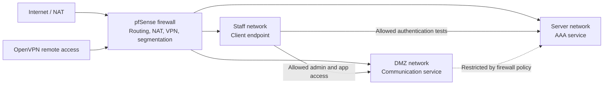

# Sanitized Topology

The private lab used a segmented design. This diagram avoids real hostnames,
student details, credentials, and unnecessary internal addresses.

## Design Notes

- Staff systems were separated from server and DMZ services.
- pfSense acted as the control point for routing, NAT, firewall policy, and VPN.
- Rocket.Chat was placed in a DMZ-style zone to separate the communication
  service from internal authentication infrastructure.
- FreeRADIUS was placed in a server zone for AAA testing.
- OpenVPN provided the remote-access control point.
- Final testing checked both allowed access and blocked paths.
