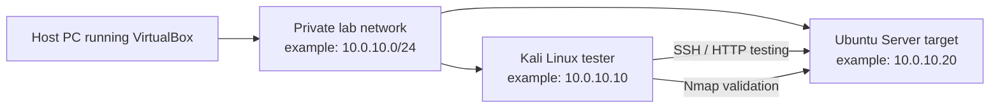

# Ubuntu Server Hardening and Validation Lab

Sanitized portfolio project documenting an Ubuntu Server hardening exercise in
a private VirtualBox cybersecurity lab. Kali Linux was used as the test
workstation to validate SSH, HTTP, firewall rules, and before/after Nmap scan
results.

This public version keeps the useful learning evidence and removes private lab
details. It does not include raw screenshots, personal usernames, MAC
addresses, passwords, private keys, VM exports, or unredacted lab IP addresses.

## Lab Purpose

The goal was to practise beginner-friendly Linux server hardening while keeping
the work legal, isolated, and repeatable. The lab focused on securing required
services instead of simply closing every open port.

## Sanitized Architecture



## Tools Used

- Oracle VirtualBox
- Kali Linux
- Ubuntu Server 24.04 LTS
- OpenSSH Server
- Apache2
- UFW firewall
- Nmap
- curl
- systemctl
- ss

## Skills Demonstrated

- Linux server administration
- SSH configuration hardening
- UFW firewall configuration
- Network connectivity testing
- Service enumeration
- Before/after security validation
- Nmap scanning in an owned lab
- Troubleshooting and evidence collection
- Professional technical documentation

## Baseline Scan Before Hardening

The Ubuntu target was scanned from Kali before applying hardening controls.
The expected lab services were visible:

```text
22/tcp open ssh
80/tcp open http
```

This confirmed that SSH and HTTP were reachable before security controls were
tightened.

## Hardening Actions

### SSH configuration backup

Before changing SSH settings, the server configuration was backed up.

```bash
sudo cp /etc/ssh/sshd_config /etc/ssh/sshd_config.bak
```

### SSH hardening settings

The SSH configuration was updated to reduce risky defaults:

```text
PermitRootLogin no
MaxAuthTries 3
ClientAliveInterval 300
X11Forwarding no
```

These changes:

- disable direct root login over SSH;
- reduce repeated login attempts;
- manage inactive sessions;
- disable unnecessary X11 forwarding.

### UFW firewall rules

UFW was configured to deny incoming traffic by default while allowing only the
required lab services from the private lab subnet.

```bash
sudo ufw default deny incoming
sudo ufw default allow outgoing
sudo ufw allow from 10.0.10.0/24 to any port 22 proto tcp
sudo ufw allow from 10.0.10.0/24 to any port 80 proto tcp
sudo ufw enable
sudo ufw status verbose
```

## Validation After Hardening

After the changes, SSH and HTTP remained reachable from the authorized lab
tester. The after-hardening scan still showed the required services:

```text
22/tcp open ssh
80/tcp open http
```

This was the expected result. The improvement came from safer SSH settings and
firewall-controlled access, not from removing services that were intentionally
required for the lab.

## Key Findings

- Required services can remain available while still being hardened.
- Before/after scans are useful only when paired with configuration evidence.
- A default-deny firewall policy helps reduce accidental exposure.
- Testing after each change prevents locking yourself out of the lab.

## Future Improvements

- Configure SSH key-based authentication.
- Disable password-based SSH login after testing SSH keys.
- Install and configure Fail2ban.
- Review authentication logs in `/var/log/auth.log`.
- Review Apache access logs.
- Add a custom Apache test page.
- Add a Windows client VM for cross-platform validation.

## Ethical Use Statement

All testing was performed inside a private VirtualBox lab using machines owned
and controlled by the learner. No scanning or testing was performed against
public systems or third-party networks.
